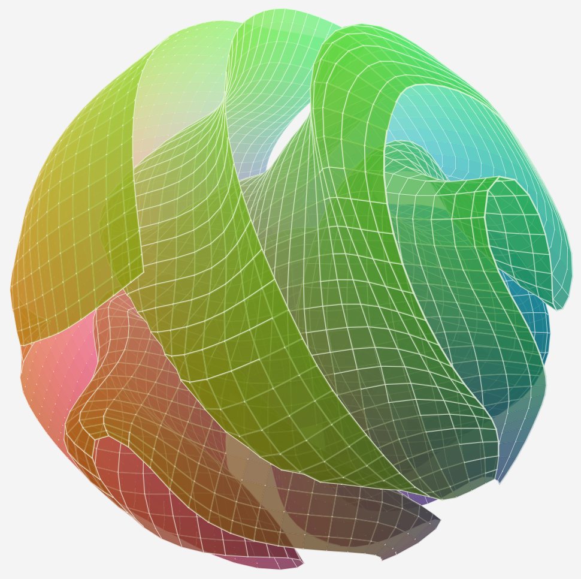
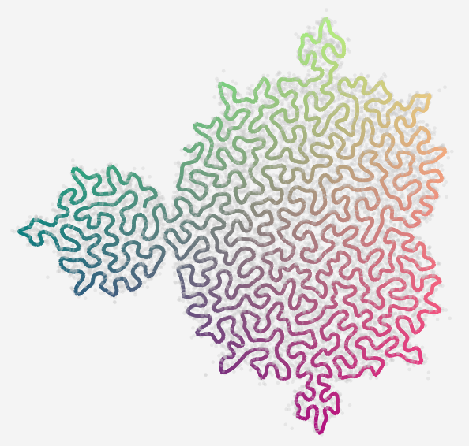
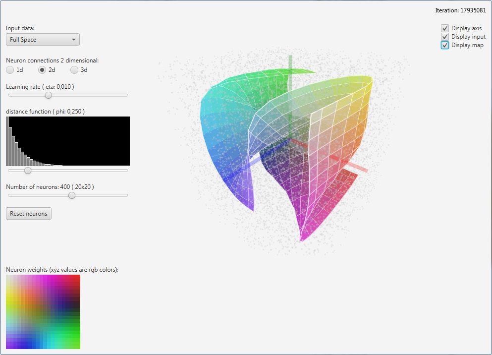
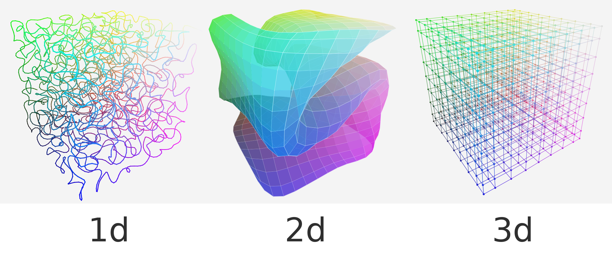
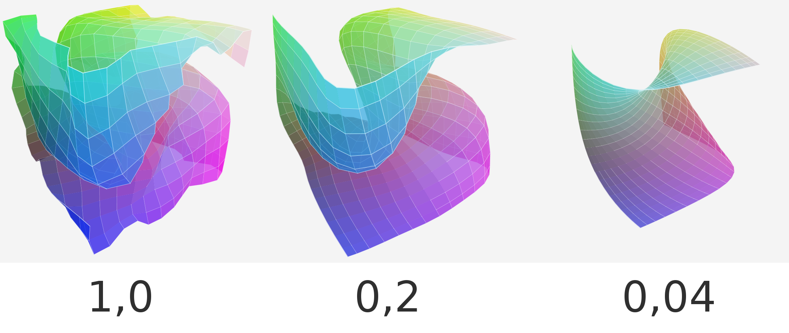
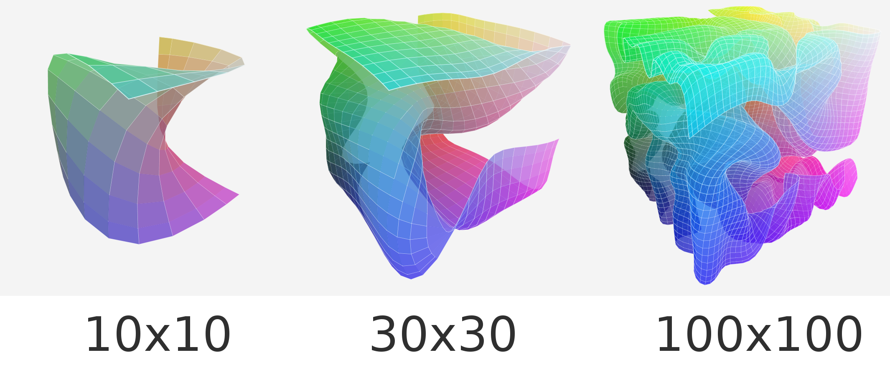

# Interactive Self Organizing Map Visualizer


This example application visualizes a Self Organizing Map (SOM) training process in 3d and lets you modify its parameters during training.

- [About](#about)
    - [Self Organizing Map](#self-organizing-map)
    - [The Application](#the-application)
- [Installation](#installation)
- [User interface](#User-interface)
- [Parameter overview](#Parameters)
    - [Neuron connections](#Neuron-connections)     
    - [Learning rate](#Learning-rate)
    - [Distance function](#Distance-function)
    - [Number of neurons](#Number-of-neurons)

## About

### Self Organizing Map
A self organizing map is a type of artificial neural network which is used for dimensional reduction. The way it does that is by having neurons organized in a map structure (in shapes like lines, squares, cubes) and fitting this map into the input distribution.

For example you can fit a line into the shape of the mandelbrot set (reduce 2d mandelbrot to 1d line):


If you want to know more about the algorithms behind a self organizing map, this blog might be interesting for you:

[Achraf KHAZRI - Self Organizing Maps](https://towardsdatascience.com/self-organizing-maps-1b7d2a84e065)

### The Application
The entire application is written in pure Java 1.8.

The training process of the som runs in a second thread. This way the visual updates do not slow down the training. Especially the 2d som takes a lot of time to visualize with big neuron counts.

## Requierments
`Java 1.8` or newer.

## Installation
Download the executable jar file [builds/interactive-som-visualizer.jar](builds/interactive-som-visualizer.jar) and open it.

Or clone the repository with `git`:
```
git clone https://github.com/mkarmann/interactive-som-visualizer
```

Then open it in any Java editor of your choice or run it directly from the console.
The main class is in [src/main/java/MainApp.java](src/main/java/MainApp.java)

## User interface


* _top left_: Parameters of the self organizing map
* _center_: 3d representation of the self organizing map and input distribution
* _top_right_: Iteration counter and the display options for the 3d view
* _bottom_left_: The resulting map with each pixel representing one neuron.

## Parameters
Self organizing maps are very stable, so feel free to just play around with each slider!

To get more into details. Here is a detailed description of all the parameters:

### Input
In this dropbox you can select a distribution you want the som to learn.

| input                	| description                                                       	|
|----------------------	|-------------------------------------------------------------------	|
| Full Space           	| Full rgb color space                                              	|
| Ball (Volume)        	| The volume of a ball                                              	|
| Sphere (Surface)     	| The surface of a ball                                             	|
| Peanut volume        	| The volume of 2 intersecting balls (same density in intersection) 	|
| 1 area distribution  	| One dense point in the center                                     	|
| 2 areas distribution 	| Two dense points                                                  	|
| 3 areas distribution 	| Two dense points with the last one streched                       	|
| Plane                	| A simple plane along the x and y axis                             	|
| Mandelbrot set       	| The 2d mandelbrot set along the x and y axis                      	|
| Mandelbrot outline   	| Outline of the 2d mandelbrot set                                  	|

### Neuron connections
Here you can select to which internal structure the som should have.


### Learning rate
The learningrate determines how big the changes of one iteration should be applied to the map.
Big steps help to find a good starting map (used at the beginning).
Small steps help to find a fine and smooth map (used at the end).

### Distance function
If one neuron gets updated, how much should its neighbours follow?
The more you slide the slider to the right, the more neurons will follow each other and therefore stay in the internal shape.
Is the slider to the left, each neuron can move freely without influencing the other ones.


### Number of neurons
More neurons means more information means more detailed representation.
If you select a small number of neurons, the computation will be much faster and the shape is easier to keep.
If you select a large number of neurons, the computation will slow down and the map gets more detailed and complex.
